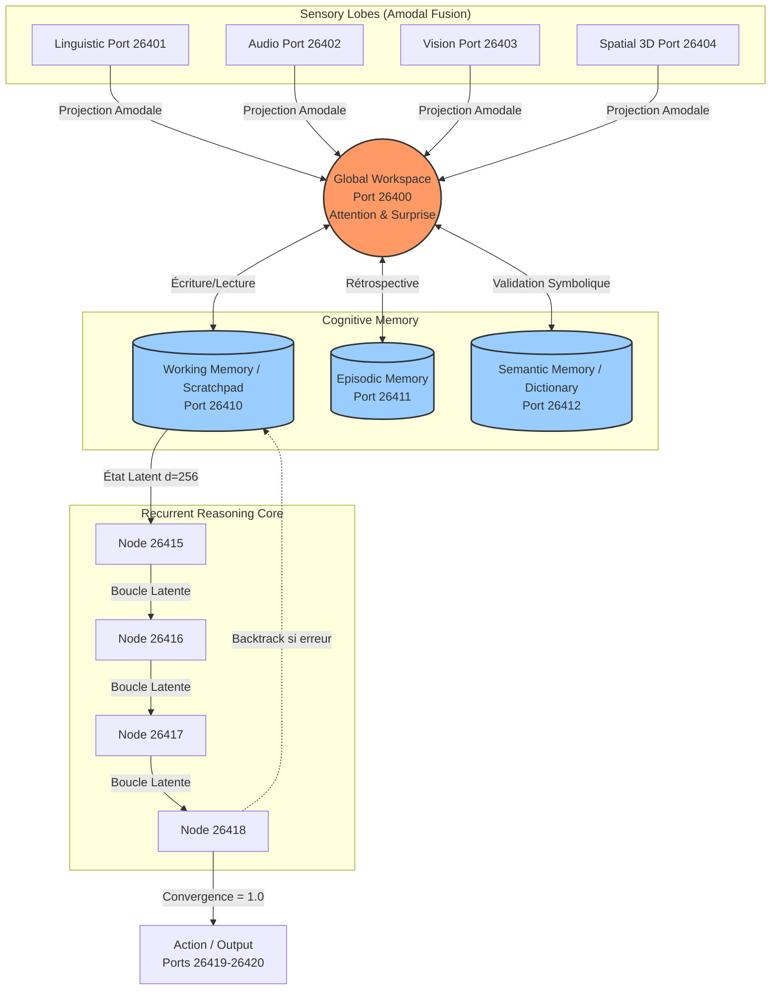
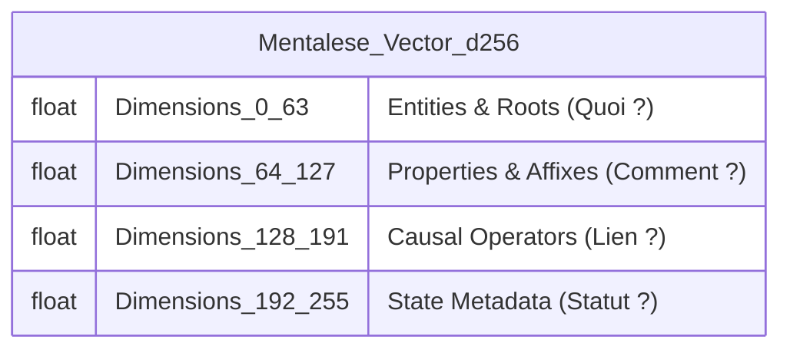
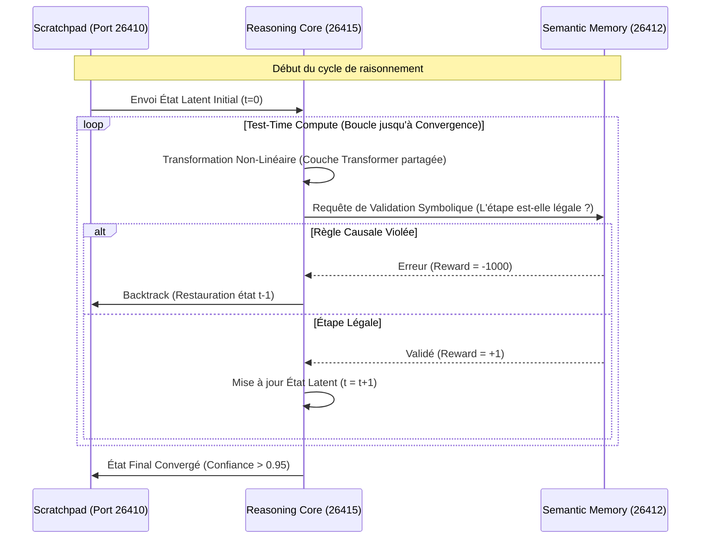

# Deep Architecture Blueprint : Miiri
## Architecture Miiri (Pensée Unifiée) via Latent-to-Symbolic Recurrence

Ce document détaille l'architecture système, les flux de données et la topologie réseau de l'IA **Miiri**. Conçue pour une rigueur de niveau "Production Grade", cette architecture résout le problème des hallucinations des LLMs en remplaçant la génération autoregressive par un **Raisonnement Latent Vérifié**.

---

### 1. Vue Macro de l'Architecture (Topologie)

L'architecture est structurée autour d'un bus de messages à latence ultra-faible (ZeroMQ) sur la plage de ports **26400-26420**. Elle sépare strictement la *Perception*, la *Mémoire*, et le *Raisonnement*.

---

### 2. Vue Micro : L'Espace Latent Quadri-Partitionné (QPLS)

**Innovation Baptisée : Quad-Partitioned Latent Semantic Space (QPLS)**
Contrairement aux espaces latents continus classiques (où le sens est distribué uniformément, rendant la composition mathématiquement instable), le vecteur Mentalese $d=256$ du Miiri est **strictement partitionné**. 

Cette innovation garantit que les opérations (ex: "ajouter un pluriel", "appliquer la gravité") n'altèrent pas l'identité de l'objet manipulé.

#### Anatomie d'une Pensée : `COMPOSE(Chant, Pluriel)`
1. **D[0-63] (Entité) :** Le radical `chant-` active un sous-vecteur spécifique. *Exemple: [0.9, -0.2, ...]*
2. **D[64-127] (Propriété) :** L'affixe de pluralité `-s` active une autre zone. *Exemple: [0.0, 0.8, ...]*
3. **D[128-191] (Opérateur) :** L'opérateur d'assemblage `CONCAT` est actif.
4. **D[192-255] (Métadonnées) :** Le vecteur enregistre `Confiance: 0.99`, `Source: Port 26401`.

**Pourquoi ça marche ?** Si le modèle essaie d'appliquer la règle `[Gravité]` (D128-191) à `[La notion de Joie]` (D0-63), le Moteur Symbolique (Port 26412) lit le vecteur. Il voit une incompatibilité de "Typage Sémantique" et refuse la composition. **L'hallucination est tuée au niveau matriciel.**

---

### 3. Le Moteur de Récurrence Fenêtrée : LSRA

**Innovation Baptisée : Latent-to-Symbolic Recurrent Architecture (LSRA)**
Le plus grand défaut des Transformers (GPT-4, Llama) est que la profondeur de leur réflexion est égale à leur nombre de couches (Paramètres). 
Le **LSRA** casse ce mur.

**Pourquoi est-ce "Production Grade" ?**
Au lieu de forcer un LLM de 70 Milliards de paramètres à tout calculer en un passage (ce qui coûte énormément de VRAM et produit des erreurs), Miiri utilise un modèle très léger (ex: 1 Milliard de paramètres) mais le fait boucler 64 fois dans sa RAM locale. 
Le coût de calcul est basculé vers le moment de l'inférence (**Test-Time Compute**), imitant le système "Slow Thinking" (Système 2) du cerveau humain.
