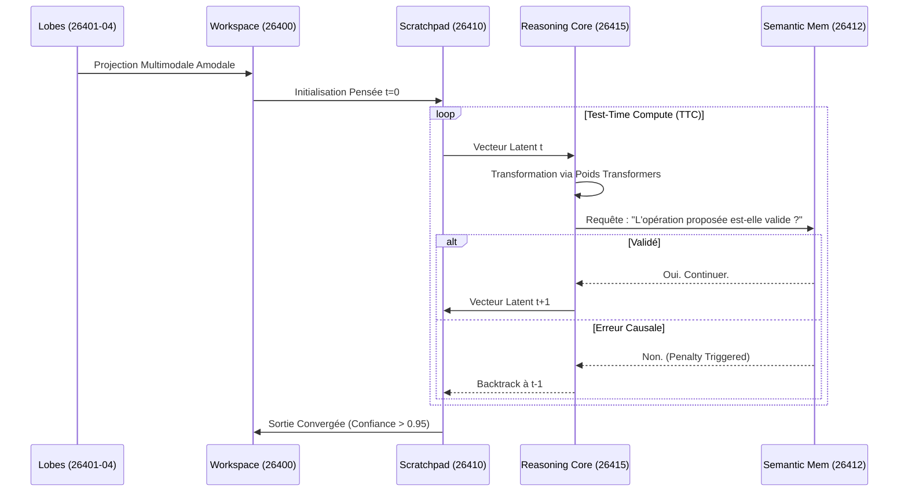

# Chapitre 3 : Architecture Système et Lobes

Ce chapitre s'adresse aux architectes. Il décrit la topologie physique et réseau du modèle, fondée sur un bus IPC (Inter-Process Communication).

## 3.1 La Cartographie des Ports (26400-26420)
L'intelligence du modèle n'émerge pas d'un seul script monolithique, mais de l'interaction de microservices appelés "Lobes", reliés par ZeroMQ.

*   **26400 : Superviseur (Global Workspace)**
    *   *Rôle :* Agit comme l'exécutif central. Il gère l'attention, détecte les anomalies causales et orchestre les sessions de sommeil (offline).
*   **26401-26404 : Encodeurs Sensoriels**
    *   *26401 (Linguistique) :* Tokenisation non pas par mot, mais par lexèmes, affixes, syntaxe. 
    *   *26402 (Audio) / 26403 (Vision) / 26404 (Spatial 3D) :* Convertissent les signaux bruts via InfoNCE en vecteurs alignés sur le QPLS.
*   **26410 : Scratchpad (Working Memory)**
    *   *Rôle :* Zone de mémoire tampon à accès ultra-rapide (RAM HBM requise). Elle stocke les étapes de raisonnement $m = (a \circ b)$.
*   **26411 : Episodic Memory**
    *   *Rôle :* Base de données Vectorielle/Graphe stockant les événements passés. Requis pour le "Transfert de Retour d'Expérience".
*   **26412 : Semantic Memory (Le Dictionnaire)**
    *   *Rôle :* Héberge le solveur symbolique (Lean/Python) et les règles inviolables (physique, grammaire) grokkées à 1.0.
*   **26415-26418 : Reasoning Core (LSRA Cluster)**
    *   *Rôle :* Le cœur "neural". Ce sont les nœuds qui exécutent le Transformer partagé et font boucler l'état latent. (C'est ici qu'on déploie les GPU lourds comme le H100).

## 3.2 Diagramme de Séquence de Résolution
Quand une tâche est reçue, voici comment l'architecture s'anime :

